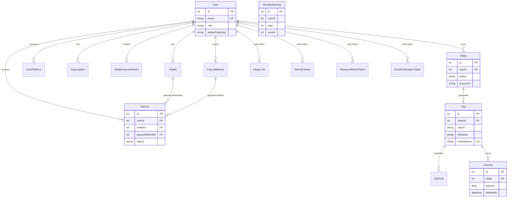

# Database Schema Documentation

The ClipCash backend uses **PostgreSQL** with **Prisma** as the ORM. The canonical schema lives in [`prisma/schema.prisma`](../prisma/schema.prisma).

---

## Entity Relationship Diagram



**Standalone tables** (no Prisma relations, but logically linked by ID columns):

- `MonthlyEarning.userId` → `User.id`
- `AnomalyAlert.earningId` → `Earning.id`, `AnomalyAlert.userId` → `User.id`
- `StellarWebhookLog`, `PlatformWebhookLog`, `PayoutFeeConfig` — global config/audit tables

---

## Models

### User

Core account entity. Supports email/password auth, OAuth (`provider` + `providerId`), MFA, and embedded Stellar wallet fields.

| Field | Type | Key | Description |
|-------|------|-----|-------------|
| `id` | Int | PK | Auto-increment primary key |
| `email` | String | UNIQUE | Login identifier |
| `password` | String? | | Hashed password; null for OAuth-only accounts |
| `mfaEnabled` | Boolean | | Two-factor authentication flag (default `false`) |
| `mfaSecret` | String? | | TOTP secret when MFA is enabled |
| `provider` | String? | | OAuth provider name (e.g. `google`) |
| `providerId` | String? | | Provider-specific user ID |
| `name` | String? | | Display name |
| `picture` | String? | | Avatar URL |
| `emailVerified` | DateTime? | | When the email was verified |
| `stellarPublicKey` | String? | | User's Stellar public key |
| `walletType` | String? | | Wallet provider (e.g. Freighter, Albedo) |
| `encryptedStellarSecret` | String? | | Encrypted Stellar secret key |
| `role` | String | | Access role (default `"user"`) |
| `createdAt` | DateTime | | Record creation timestamp |
| `updatedAt` | DateTime | | Last update timestamp |

**Constraints:** `@@unique([provider, providerId])` for OAuth identity.

**Relations:** 1 → N `Video`, `UserPlatform`, `Subscription`, `StellarPaymentIntent`, `Wallet`, `Payout`, `PayoutMethod`, `MagicLink`, `RefreshToken`, `PasswordResetToken`, `EmailVerificationToken`.

---

### Video

Source video uploaded or imported (YouTube, URL, etc.) by a user. Drives the clip-generation pipeline.

| Field | Type | Key | Description |
|-------|------|-----|-------------|
| `id` | Int | PK | Auto-increment primary key |
| `userId` | Int | FK → User | Owner |
| `title` | String? | | Video title |
| `description` | String? | | Video description |
| `sourceType` | String | | Source kind (default `"youtube"`) |
| `sourceUrl` | String | | Original URL or storage reference |
| `thumbnail` | String? | | Thumbnail URL |
| `duration` | Int? | | Duration in seconds |
| `fileSize` | BigInt? | | File size in bytes |
| `status` | String | INDEX | Pipeline status (see [Status values](#status-values)) |
| `processingError` | String? | | Error message when generation fails |
| `processingStats` | Json? | | Processing metrics (see [JSON fields](#json-field-shapes)) |
| `targetPlatforms` | Json? | | Platforms selected for posting |
| `createdAt` | DateTime | | Record creation timestamp |
| `updatedAt` | DateTime | | Last update timestamp |

**Relations:** N → 1 `User` (CASCADE delete), 1 → N `Clip`.

**Indexes:** `userId`, `status`.

---

### Clip

A short clip generated from a source video. Holds timeline bounds, posting metadata, and optional NFT mint data.

| Field | Type | Key | Description |
|-------|------|-----|-------------|
| `id` | Int | PK | Auto-increment primary key |
| `videoId` | Int | FK → Video | Parent video |
| `clipUrl` | String | | Cloudinary (or storage) URL for the clip |
| `thumbnail` | String? | | Thumbnail URL |
| `platform` | String? | | Target platform hint |
| `title` | String? | | Clip title |
| `caption` | String? | | Post caption / hashtags |
| `startTime` | Float | | Start offset in source video (seconds) |
| `endTime` | Float | | End offset in source video (seconds) |
| `duration` | Int | | Clip duration in seconds |
| `viralityScore` | Float? | | AI/heuristic engagement score |
| `royaltyBps` | Int? | | NFT royalty in basis points (0–1500 = 0–15%) |
| `postStatus` | Json? | | Aggregate posting state (platform-specific JSON allowed) |
| `postedAt` | DateTime? | | When the clip was first posted |
| `metadataUri` | String? | | IPFS/HTTP URI for NFT metadata |
| `mintAddress` | String? | UNIQUE | On-chain NFT contract address |
| `mintedAt` | DateTime? | | When the NFT was minted |
| `nftStatus` | String | | Mint lifecycle (default `"none"`) |
| `createdAt` | DateTime | | Record creation timestamp |
| `updatedAt` | DateTime | | Last update timestamp |

**Relations:** N → 1 `Video` (CASCADE delete), 1 → N `ClipPost`, `Earning`.

**Indexes:** `videoId`, `mintAddress` (unique).

---

### ClipPost

One row per clip × platform publish attempt. Tracks retries and external post IDs.

| Field | Type | Key | Description |
|-------|------|-----|-------------|
| `id` | Int | PK | Auto-increment primary key |
| `clipId` | Int | FK → Clip | Parent clip |
| `platform` | String | INDEX | Target platform (e.g. `tiktok`, `instagram`) |
| `status` | String | | `pending`, `published`, or `failed` |
| `postId` | String? | | Platform-assigned post identifier |
| `attempts` | Int | | Retry count (default `0`) |
| `error` | String? | | Last failure message |
| `createdAt` | DateTime | | Record creation timestamp |
| `updatedAt` | DateTime | | Last update timestamp |

**Relations:** N → 1 `Clip` (CASCADE delete).

**Indexes:** `clipId`, `platform`.

---

### Earning

Revenue attributed to a clip. Supports soft delete and anomaly flagging.

| Field | Type | Key | Description |
|-------|------|-----|-------------|
| `id` | Int | PK | Auto-increment primary key |
| `clipId` | Int | FK → Clip | Source clip |
| `amount` | Float | | Earned amount |
| `currency` | String | | ISO currency (default `"USD"`) |
| `date` | DateTime | | Earning date (for aggregation) |
| `source` | String? | | Origin (e.g. `royalty`, platform name) |
| `isAnomaly` | Boolean | | Flagged as suspicious (default `false`) |
| `anomalyReason` | String? | | Why the earning was flagged |
| `createdAt` | DateTime | | Record creation timestamp |
| `deletedAt` | DateTime? | | Soft-delete timestamp |

**Relations:** N → 1 `Clip` (CASCADE delete).

---

### MonthlyEarning

Pre-aggregated monthly totals per user. Used for dashboards and reporting.

| Field | Type | Key | Description |
|-------|------|-----|-------------|
| `id` | Int | PK | Auto-increment primary key |
| `userId` | Int | | Owner (logical FK to `User.id`) |
| `year` | Int | | Calendar year |
| `month` | Int | | Calendar month (1–12) |
| `totalAmount` | Float | | Sum of earnings for the period |
| `currency` | String | | ISO currency (default `"USD"`) |
| `platformBreakdown` | Json? | | Per-platform totals |
| `createdAt` | DateTime | | Record creation timestamp |
| `updatedAt` | DateTime | | Last update timestamp |

**Constraints:** `@@unique([userId, year, month])`.

**Indexes:** `userId`, `[year, month]`.

---

### UserPlatform

OAuth connection to an external publishing platform (TikTok, Instagram, etc.).

| Field | Type | Key | Description |
|-------|------|-----|-------------|
| `id` | Int | PK | Auto-increment primary key |
| `userId` | Int | FK → User | Owner |
| `platform` | String | | Platform identifier |
| `username` | String? | | Connected account username |
| `accessToken` | String? | | Encrypted OAuth access token |
| `refreshToken` | String? | | Encrypted OAuth refresh token |
| `connectedAt` | DateTime | | When the connection was established |
| `updatedAt` | DateTime | | Last token refresh / update |

**Relations:** N → 1 `User` (CASCADE delete).

---

### Wallet

User-linked blockchain wallet used for Stellar payouts.

| Field | Type | Key | Description |
|-------|------|-----|-------------|
| `id` | Int | PK | Auto-increment primary key |
| `userId` | Int | FK → User | Owner |
| `address` | String | | Wallet address |
| `chain` | String | | Blockchain (default `"stellar"`) |
| `type` | String | | Wallet type / provider |
| `connectedAt` | DateTime | | When the wallet was linked |
| `updatedAt` | DateTime | | Last update timestamp |
| `deletedAt` | DateTime? | | Soft-delete timestamp |

**Relations:** N → 1 `User` (CASCADE delete), 1 → N `Payout`.

**Constraints:** `@@unique([address, chain])`.

**Indexes:** `userId`.

---

### PayoutMethod

Stored bank or payment details for fiat payouts. Sensitive fields are encrypted at rest.

| Field | Type | Key | Description |
|-------|------|-----|-------------|
| `id` | Int | PK | Auto-increment primary key |
| `userId` | Int | FK → User | Owner |
| `type` | String | INDEX | Method type (e.g. bank transfer) |
| `isDefault` | Boolean | | Default payout method for the user |
| `encryptedAccountNumber` | String? | | Encrypted account number |
| `encryptedRoutingNumber` | String? | | Encrypted routing number |
| `encryptedSwiftCode` | String? | | Encrypted SWIFT/BIC |
| `encryptedIban` | String? | | Encrypted IBAN |
| `bankName` | String? | | Bank display name |
| `accountHolderName` | String? | | Account holder |
| `country` | String? | | Country code |
| `currency` | String | | Payout currency (default `"USD"`) |
| `lastFourDigits` | String? | | Masked account suffix for UI |
| `createdAt` | DateTime | | Record creation timestamp |
| `updatedAt` | DateTime | | Last update timestamp |
| `deletedAt` | DateTime? | | Soft-delete timestamp |

**Relations:** N → 1 `User` (CASCADE delete), 1 → N `Payout`.

**Indexes:** `userId`, `type`.

---

### Payout

Withdrawal request from user earnings to a wallet or bank method.

| Field | Type | Key | Description |
|-------|------|-----|-------------|
| `id` | Int | PK | Auto-increment primary key |
| `userId` | Int | FK → User | Recipient |
| `walletId` | Int? | FK → Wallet | Stellar wallet destination |
| `payoutMethodId` | Int? | FK → PayoutMethod | Bank/fiat destination |
| `amount` | Float | | Requested gross amount |
| `currency` | String | | ISO currency (default `"USD"`) |
| `method` | String | | Payout channel (e.g. `stellar`, `bank`) |
| `status` | String | INDEX | Lifecycle status (see [Status values](#status-values)) |
| `transactionId` | String? | | External processor transaction ID |
| `stellarXdr` | String? | | Stellar transaction envelope (XDR) |
| `onChainTxHash` | String? | | Confirmed on-chain hash |
| `confirmedAt` | DateTime? | | On-chain confirmation time |
| `paidAt` | DateTime? | | When funds were delivered |
| `approvedAt` | DateTime? | | Admin approval timestamp |
| `rejectedAt` | DateTime? | | Rejection timestamp |
| `rejectionReason` | String? | | Why the payout was rejected |
| `feeAmount` | Float? | | Applied fee in currency units |
| `feePercentage` | Float? | | Fee rate used |
| `finalAmount` | Float? | | Net amount after fees |
| `retryCount` | Int | | Verification retry count |
| `lastAttemptAt` | DateTime? | | Last verification attempt |
| `createdAt` | DateTime | | Record creation timestamp |
| `updatedAt` | DateTime | | Last update timestamp |

**Relations:** N → 1 `User` (CASCADE delete), optional N → 1 `Wallet`, optional N → 1 `PayoutMethod`.

**Indexes:** `payoutMethodId`, `status`.

---

### PayoutFeeConfig

Global fee rules per payout method. One active row per `method`.

| Field | Type | Key | Description |
|-------|------|-----|-------------|
| `id` | Int | PK | Auto-increment primary key |
| `method` | String | UNIQUE | Payout method identifier |
| `feePercentage` | Float | | Percentage fee |
| `fixedFee` | Float | | Flat fee (default `0`) |
| `minFee` | Float | | Minimum fee floor |
| `maxFee` | Float? | | Maximum fee cap |
| `isActive` | Boolean | | Whether this config is in use |
| `createdAt` | DateTime | | Record creation timestamp |
| `updatedAt` | DateTime | | Last update timestamp |

---

### Subscription

User subscription plan (Stripe or Stellar payment).

| Field | Type | Key | Description |
|-------|------|-----|-------------|
| `id` | Int | PK | Auto-increment primary key |
| `userId` | Int | FK → User | Subscriber |
| `plan` | String | | Plan tier (e.g. Basic, Pro) |
| `status` | String | | Active/cancelled/expired state |
| `paymentMethod` | String | | `stripe` (default) or `stellar` |
| `startDate` | DateTime | | Subscription start |
| `endDate` | DateTime? | | Subscription end (null if ongoing) |
| `stellarTxHash` | String? | | Stellar payment transaction hash |
| `stellarMemo` | String? | | Stellar payment memo |
| `createdAt` | DateTime | | Record creation timestamp |
| `updatedAt` | DateTime | | Last update timestamp |

**Relations:** N → 1 `User` (CASCADE delete).

---

### StellarPaymentIntent

Short-lived intent for a Stellar subscription payment before confirmation.

| Field | Type | Key | Description |
|-------|------|-----|-------------|
| `id` | String | PK | CUID primary key |
| `userId` | Int | FK → User | Payer |
| `amount` | Float | | Expected payment amount |
| `asset` | String | | Stellar asset code |
| `destination` | String | | Destination account |
| `memo` | String | | Payment memo for matching |
| `status` | String | | Intent status (default `"pending"`) |
| `expiresAt` | DateTime | | Intent expiry |
| `transactionId` | String? | | Matched transaction after payment |
| `plan` | String | | Subscription plan being purchased |
| `createdAt` | DateTime | | Record creation timestamp |
| `updatedAt` | DateTime | | Last update timestamp |

**Relations:** N → 1 `User` (CASCADE delete).

---

### MagicLink

Passwordless login tokens (hashed, single-use).

| Field | Type | Key | Description |
|-------|------|-----|-------------|
| `id` | Int | PK | Auto-increment primary key |
| `userId` | Int | FK → User | Target user |
| `tokenHash` | String | UNIQUE | Hashed token value |
| `expiresAt` | DateTime | | Expiration time |
| `usedAt` | DateTime? | | When the link was consumed |
| `createdAt` | DateTime | | Record creation timestamp |

**Relations:** N → 1 `User` (CASCADE delete).

**Indexes:** `tokenHash`.

---

### RefreshToken

JWT refresh tokens with optional device fingerprint metadata.

| Field | Type | Key | Description |
|-------|------|-----|-------------|
| `id` | Int | PK | Auto-increment primary key |
| `userId` | Int | FK → User | Token owner |
| `tokenHash` | String | UNIQUE | Hashed refresh token |
| `expiresAt` | DateTime | | Expiration time |
| `revokedAt` | DateTime? | | Revocation time |
| `userAgentHash` | String? | | Hashed User-Agent for session binding |
| `ipAddress` | String? | | Client IP at issuance |
| `acceptLanguage` | String? | | Client Accept-Language header |
| `createdAt` | DateTime | | Record creation timestamp |

**Relations:** N → 1 `User` (CASCADE delete).

**Indexes:** `userId`.

---

### PasswordResetToken

Single-use tokens for password reset flows.

| Field | Type | Key | Description |
|-------|------|-----|-------------|
| `id` | Int | PK | Auto-increment primary key |
| `userId` | Int | FK → User | Target user |
| `tokenHash` | String | UNIQUE | Hashed token value |
| `expiresAt` | DateTime | | Expiration time |
| `usedAt` | DateTime? | | When the token was consumed |
| `createdAt` | DateTime | | Record creation timestamp |

**Relations:** N → 1 `User` (CASCADE delete).

**Indexes:** `userId`, `tokenHash`.

---

### EmailVerificationToken

Single-use tokens for email verification.

| Field | Type | Key | Description |
|-------|------|-----|-------------|
| `id` | Int | PK | Auto-increment primary key |
| `userId` | Int | FK → User | Target user |
| `tokenHash` | String | UNIQUE | Hashed token value |
| `expiresAt` | DateTime | | Expiration time |
| `usedAt` | DateTime? | | When the token was consumed |
| `createdAt` | DateTime | | Record creation timestamp |

**Relations:** N → 1 `User` (CASCADE delete).

**Indexes:** `userId`, `tokenHash`.

---

### StellarWebhookLog

Idempotent log of processed Stellar webhook events.

| Field | Type | Key | Description |
|-------|------|-----|-------------|
| `id` | Int | PK | Auto-increment primary key |
| `transactionId` | String | UNIQUE | Stellar transaction ID |
| `payload` | String | | Raw webhook payload |
| `processedAt` | DateTime | INDEX | Processing timestamp |

**Indexes:** `transactionId`, `processedAt`.

---

### PlatformWebhookLog

Audit log for inbound webhooks from external platforms.

| Field | Type | Key | Description |
|-------|------|-----|-------------|
| `id` | Int | PK | Auto-increment primary key |
| `platform` | String | INDEX | Source platform |
| `eventType` | String | | Webhook event type |
| `payload` | String | | Raw payload body |
| `signature` | String? | | Provided signature header |
| `isValid` | Boolean | | Whether signature verification passed |
| `processedAt` | DateTime | INDEX | Processing timestamp |
| `error` | String? | | Processing error, if any |

**Indexes:** `platform`, `processedAt`.

---

### AnomalyAlert

Alerts raised when an earning is flagged as anomalous.

| Field | Type | Key | Description |
|-------|------|-----|-------------|
| `id` | Int | PK | Auto-increment primary key |
| `earningId` | Int | | Related earning (logical FK) |
| `userId` | Int | INDEX | Affected user (logical FK) |
| `amount` | Float | | Flagged amount |
| `reason` | String | | Why it was flagged |
| `severity` | String | | Alert severity level |
| `isResolved` | Boolean | INDEX | Resolution flag |
| `resolvedAt` | DateTime? | | When resolved |
| `createdAt` | DateTime | INDEX | Alert creation time |

**Indexes:** `userId`, `isResolved`, `createdAt`.

---

## Relationships & Delete Behavior

| Parent | Child | On delete |
|--------|-------|-----------|
| `User` | `Video`, `UserPlatform`, `Subscription`, `StellarPaymentIntent`, `Wallet`, `Payout`, `PayoutMethod`, auth tokens | **CASCADE** |
| `Video` | `Clip` | **CASCADE** |
| `Clip` | `ClipPost`, `Earning` | **CASCADE** |
| `Wallet` | `Payout` | No cascade (nullable FK) |
| `PayoutMethod` | `Payout` | No cascade (nullable FK) |

Deleting a user removes all owned content, connections, payouts, and auth tokens. Deleting a video removes its clips and their posts/earnings.

---

## Indexes Summary

| Table | Index | Purpose |
|-------|-------|---------|
| `User` | `email` (unique) | Fast login lookup |
| `User` | `[provider, providerId]` (unique) | OAuth identity |
| `Video` | `userId` | List videos by owner |
| `Video` | `status` | Filter by pipeline state |
| `Clip` | `videoId` | List clips for a video |
| `Clip` | `mintAddress` (unique) | NFT lookup |
| `ClipPost` | `clipId`, `platform` | Post status per platform |
| `Wallet` | `userId`, `[address, chain]` (unique) | Wallet lookup |
| `Payout` | `payoutMethodId`, `status` | Payout queues |
| `PayoutMethod` | `userId`, `type` | User payout methods |
| `MonthlyEarning` | `userId`, `[year, month]`, unique composite | Monthly rollups |
| Auth tokens | `tokenHash`, `userId` | Token validation |
| Webhook logs | `transactionId`, `platform`, `processedAt` | Dedup and audit |

---

## JSON Field Shapes

### `Video.processingStats`

Documented inline in the schema:

```json
{
  "momentsFound": 0,
  "inputQuality": "string",
  "durationSec": 0,
  "clipsGenerated": 0,
  "timeTakenMs": 0,
  "errorDetails": "string (optional)"
}
```

### `Video.targetPlatforms`

Array or object of platform identifiers selected for auto-posting (structure varies by upload flow).

### `Clip.postStatus`

String enum (`pending`, `posted`, `failed`) or platform-specific JSON when multiple platforms are tracked in one field.

### `MonthlyEarning.platformBreakdown`

Per-platform earning totals for the month, e.g. `{ "tiktok": 120.5, "youtube": 80.0 }`.

---

## Status Values

Status fields are stored as plain strings (not Prisma enums). Application code defines the allowed values:

| Model / field | Common values |
|---------------|---------------|
| `Video.status` | `pending`, `processing`, `done`, `failed`, `cancelled` |
| `Clip.nftStatus` | `none`, `minting`, `minted`, `failed` |
| `ClipPost.status` | `pending`, `published`, `failed` |
| `Payout.status` | `pending`, `processing`, `completed`, plus approval/rejection states |
| `StellarPaymentIntent.status` | `pending`, confirmed/failed variants |
| `Subscription.status` | Plan lifecycle states (active, cancelled, etc.) |

---

## Conventions

- **Timestamps:** Most models include `createdAt` (set on insert) and `updatedAt` (auto-updated by Prisma where defined).
- **Soft delete:** `Earning.deletedAt`, `Wallet.deletedAt`, and `PayoutMethod.deletedAt` — queries should filter `deletedAt IS NULL` unless including deleted records intentionally.
- **Sensitive data:** Passwords are hashed; OAuth tokens, bank details, and Stellar secrets are encrypted before storage. Only hashes are stored for magic links and refresh tokens.
- **Currency:** Defaults to `"USD"` on monetary fields; conversion happens in the earnings service layer.
- **Migrations:** Schema changes go through Prisma migrations in `prisma/migrations/`. Run `npx prisma migrate dev` locally or `npx prisma migrate deploy` in production.

---

## Related Documentation

- [Architecture overview](./architecture.md) — how services use these models in core flows
- [Stellar integration](./stellar-integration.md) — wallets, minting, and on-chain payouts
- [Prisma query optimization](./prisma-query-optimization.md) — indexing and query patterns
