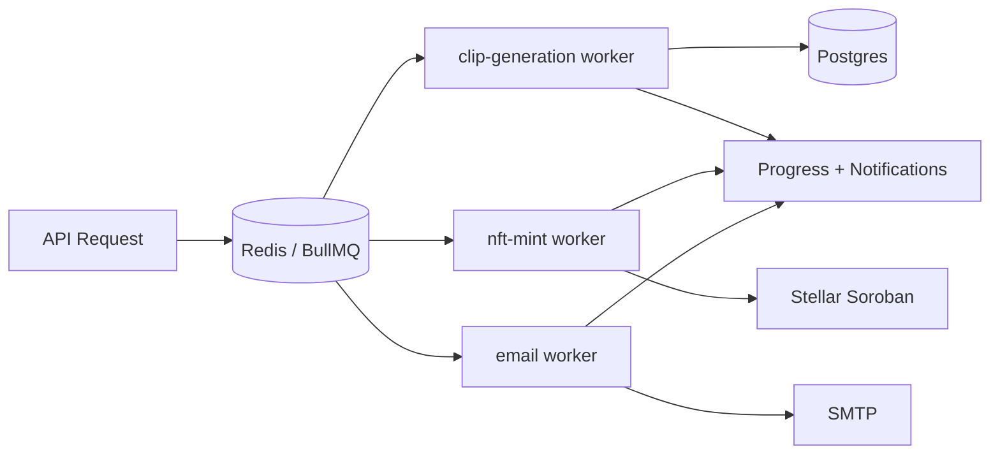

# Queue Architecture

Comprehensive documentation for the ClipCash async queue architecture (Issues #924, #973).
BullMQ backed by Redis. See also `docs/queue-flows.md` for per-flow walkthroughs.

## Table of Contents

1. [Request to Job Lifecycle](#1-request-to-job-lifecycle)
2. [Redis Architecture](#2-redis-architecture)
3. [BullMQ Architecture](#3-bullmq-architecture)
4. [Queues](#4-queues)
5. [Workers](#5-workers)
6. [Concurrency Configuration](#6-concurrency-configuration)
7. [Retry Policies](#7-retry-policies)
8. [Dead-Letter Handling](#8-dead-letter-handling)
9. [Queue Cleanup](#9-queue-cleanup)
10. [Monitoring](#10-monitoring)
11. [Scaling Recommendations](#11-scaling-recommendations)
12. [Architecture Diagrams](#12-architecture-diagrams)
13. [Queue API Reference](#13-queue-api-reference)
14. [Troubleshooting Guide](#14-troubleshooting-guide)

## 1. Request to Job Lifecycle

```
API Request (controller, JWT + throttle)
  -> Service validates input
  -> queue.add(JOB_NAME, data, { jobId?, attempts, backoff, priority })
  -> Redis (BullMQ persisted job)
  -> Worker processor picks job (concurrency slots)
  -> DB / external service (Soroban, Cloudinary, SMTP)
  -> Job progress events -> completion notification
  -> removeOnComplete / removeOnFail retention
```

Which queue receives the job is decided by the service: clip generation goes to
`clip-generation`, social posts to `clip-posting`, NFT mints to `nft-mint`
(`src/clips/nft-mint.queue.ts`, deterministic `jobId = nft-mint-clip-{clipId}`
for duplicate prevention), emails to `email-delivery`, earnings anomaly checks
to `anomaly-detection`.

## 2. Redis Architecture

- Connection centralized in `QueueConfigService` (`src/queue/queue-config.service.ts`):
  `QUEUE_REDIS_HOST/PORT/USERNAME/PASSWORD/DB`, optional `QUEUE_REDIS_TLS`,
  shared `QUEUE_PREFIX` (default `clips`).
- `RedisService` (`src/redis/redis.service.ts`) exposes the client for caches
  and rate limiting; BullMQ uses the same host via `BullModule.forRootAsync`.
- Monitor with `INFO replication`, `CLIENT LIST`, memory (`maxmemory-policy
  noeviction` recommended), and keyspace hits/misses.

## 3. BullMQ Architecture

- `QueueModule` (`src/queue/queue.module.ts`) is `@Global()` and registers all
  queues: `clip-generation`, `clip-posting`, `nft-mint`, `email-delivery`,
  `anomaly-detection` (`REGISTERED_QUEUE_NAMES`).
- Default job options per queue (priority constants in each `*.queue.ts`).
- Processors (`*.processor.ts`) run in-process; each declares `@Processor(name)`
  with a concurrency option.

## 4. Queues

| Queue | Processor | Priority | Purpose |
|-------|-----------|----------|---------|
| `clip-generation` | `clip-generation.processor.ts` | high | FFmpeg/Cloudinary clip rendering |
| `clip-posting` | `clip-posting.processor.ts` | medium | Social posting |
| `nft-mint` | `nft-mint.processor.ts` | 4 | Soroban NFT mint transactions, isolated from video workloads (Issue #923) |
| `email-delivery` | `email-delivery.processor.ts` | 5 | Verification, password-reset, magic-link, queue alerts |
| `anomaly-detection` | `anomaly-detection.processor.ts` | low | Earnings anomaly background checks |

## 5. Workers

Each worker (`src/clips/*processor.ts`, `src/auth/email-delivery.processor.ts`,
`src/earnings/anomaly-detection.processor.ts`):

1. Receives typed job data (interfaces in `*.queue.ts`).
2. Updates status rows (e.g. `NftMintStatusService` stages
   `none -> upload -> prepare -> submit -> confirm`, `fail` on error).
3. Emits progress (`job.updateProgress`) consumed by progress endpoints.
4. Throws on transient failure (retry) or returns failure state on permanent
   errors.

## 6. Concurrency Configuration

- Per-processor `concurrency` option (see each `*.processor.ts`).
- `nft-mint` uses low concurrency (blockchain nonce safety).
- Tune via env; scale horizontally by adding worker replicas (see §11).

## 7. Retry Policies

Centralized defaults in `QueueConfigService.runtime` (`QUEUE_DEFAULT_ATTEMPTS=3`,
`QUEUE_DEFAULT_BACKOFF_DELAY_MS`) and per-queue overrides:

| Queue | Attempts | Backoff |
|-------|----------|---------|
| `clip-generation` | 3 | exponential, 1s base |
| `nft-mint` | 3 (`NFT_MINT_JOB_OPTIONS`) | exponential, 2s base |
| `email-delivery` | 5 (`EMAIL_JOB_OPTIONS`) | exponential, 500ms base |

`RetryBackoffConfigService` (`src/queue/retry-backoff-config.service.ts`)
exposes typed retry/backoff configs. `removeOnComplete`/`removeOnFail` per queue
(email: `true`/`false`; mint: `false`/`false` for auditing).

## 8. Dead-Letter Handling

Jobs exhausting attempts stay in the `failed` set (`removeOnFail: false` for
mint/email) for post-mortem via `QueueHealthService`. Permanent failures are
recorded in status rows (`permanentFailure`, `failureReason`,
`NftMintStatusService`) and surfaced to users; operators inspect via the queue
dashboard (`src/queue-dashboard/`).

## 9. Queue Cleanup

- Completed email jobs auto-removed (`removeOnComplete: true`).
- Mint/anomaly jobs retained for auditing (`removeOnComplete: false`).
- Periodic `queue.clean()` / `obliterate()` in maintenance windows; monitor
  Redis memory first.

## 10. Monitoring

- `QueueHealthService` (`src/queue/queue-health.service.ts`): health and
  statistics per queue (counts, completed/failed).
- Health endpoints (see §13), `FailedJobNotificationService` and
  `SlackNotificationService` (`src/queue/`) for alerts.
- Redis monitoring: `INFO stats`, slowlog, memory fragmentation.

## 11. Scaling Recommendations

1. Separate worker processes per queue (isolate `nft-mint` from video).
2. Increase `nft-mint` concurrency only with nonce management.
3. Add Redis replicas/sentinel for HA; keep `QUEUE_REDIS_DB` dedicated.
4. Autoscale on queue depth (`waiting + delayed` via health endpoints).

## 12. Architecture Diagrams



## 13. Queue API Reference

All endpoints require JWT Bearer (`access-token`) unless noted. Base path `/api`.

### Queue health

- `GET /queue/health` — per-queue waiting/active/completed/failed counts.
  - `200 { queues: [{ name, waiting, active, completed, failed }] }`
  - `401` missing/invalid JWT.

### Job status

- `GET /nfts/:id/mint-status` — NFT mint lifecycle (`none|upload|prepare|submit|confirm|fail`) with `txHash`, `retryCount`, `jobId`.
  - `200 MintStatusResponseDto`, `404` clip not found.
- `GET /queue/jobs/:jobId` — generic BullMQ job state (`queued|active|completed|failed|delayed`), progress percent.
  - `404` unknown jobId.

### Job progress

- Progress via `job.updateProgress(n)`; poll `GET /queue/jobs/:jobId` or subscribe to completion notifications.
- `429` when polling exceeds throttle windows.

### Notifications

- `FailedJobNotificationService` persists failure records; completion pushes via
  existing notification endpoints (`src/queue/slack-notification.service.ts`).

### Admin queue endpoints

- Require admin role; list/retry/drain queues. `403` for non-admins.

### NFT mint job endpoints (Issue #923)

- `POST /nfts/mint` — enqueues `nft-mint` job (`jobId: nft-mint-clip-{clipId}`).
  - `201 NftMintResponseDto` (includes `jobId`), `409` duplicate-mint (job exists), `429` throttled (5/60s), `401`/`403`/`404` as documented in `nft.controller.ts`.
- `POST /nfts/prepare-mint` — builds Soroban XDR; `409` if already minting/minted, `429` when throttled, `503` Soroban RPC unavailable.
- Transaction states: `queued|active|completed|failed|delayed` (`NFT_MINT_TX_STATES`).

### Common errors

| Code | Meaning |
|------|---------|
| `400` | Invalid payload/DTO validation |
| `401` | Missing/invalid JWT |
| `403` | Not owner / not admin |
| `404` | Clip/job not found |
| `409` | Duplicate mint job exists |
| `429` | Rate limit exceeded, retry after window |
| `503` | Soroban RPC unavailable |

### Async lifecycle

`202/201` returns immediately with `jobId`; client polls status/progress;
completion updates `mint-status`; failures remain queryable (`removeOnFail:
false`).

## 14. Troubleshooting Guide

| Symptom | Likely cause | Fix |
|---------|--------------|-----|
| Jobs stuck `waiting` | No worker running / Redis down | Start workers, check `QUEUE_REDIS_*`, `redis-cli ping` |
| `409` on first mint | Stale jobId from earlier attempt | Check `mint-status`; wait or clear failed job |
| `429` on mint | `nftMint` throttle 5/60s | Back off, retry after 60s |
| Mint `failed` permanent | Soroban RPC down / bad metadata | Check RPC circuit breaker, `failureReason` |
| Redis memory growth | Retained completed jobs | Run `queue.clean()`, review `removeOnComplete` |
| Duplicate mints | Bypassed queue (direct contract call) | Always enqueue via API so `jobId` dedup applies |

Closes #924. Closes #973.
